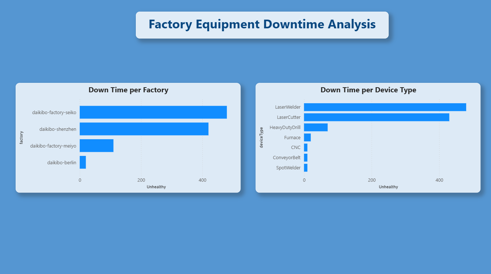

# 🏭 Deloitte Factory Analytics — Virtual Internship

Completed as part of the **Deloitte Data Analytics 
Virtual Internship** on Forage.

---

## 🏢 About the Internship

This virtual experience simulates analyst work at 
Deloitte, one of the Big Four consulting firms. 
The task involved analysing manufacturing data 
to identify operational inefficiencies across 
factory locations.

---

## 📌 Business Context

Daikibo Industrials, a global manufacturing client, 
needed to understand which factories and equipment 
types were experiencing the most downtime — to 
prioritise maintenance and reduce operational losses.

---

## ❓ Questions Answered

**Question 1 — Which factory has the most downtime?**
Identify the highest-risk factory location by 
total unhealthy device count.

**Question 2 — Which device types fail the most?**
Identify equipment categories driving the 
majority of downtime across all factories.

---

## 📊 Dashboard

---

## 💡 Key Insights

- **Daikibo-Factory-Seiko** has the highest downtime, 
  followed closely by Daikibo-Shenzhen — these two 
  locations account for the majority of failures
- **LaserWelder and LaserCutter** are by far the most 
  failure-prone device types, each with 400+ 
  unhealthy counts
- **Daikibo-Berlin** shows minimal downtime — could 
  serve as a benchmark for best maintenance practices
- Lower-risk devices like SpotWelder and ConveyorBelt 
  suggest maintenance resources should be 
  redirected toward laser equipment

---

## 🛠️ Tools Used

- Microsoft Excel (data cleaning and preparation)
- Power BI (dashboard and visualisations)

> 📝 Note: This internship task recommended Tableau 
> for visualisation. I completed it using Power BI, 
> demonstrating the same analytical outcomes with 
> a different industry-standard tool.

---

## 🏆 Certification

This internship was completed with certification 
via [Forage](https://www.theforage.com/).

---

## 🏢 Context

Completed via the **Deloitte Australia Data Analytics 
Virtual Experience Program** on Forage — simulating 
real consulting analyst work for a global 
manufacturing client.
